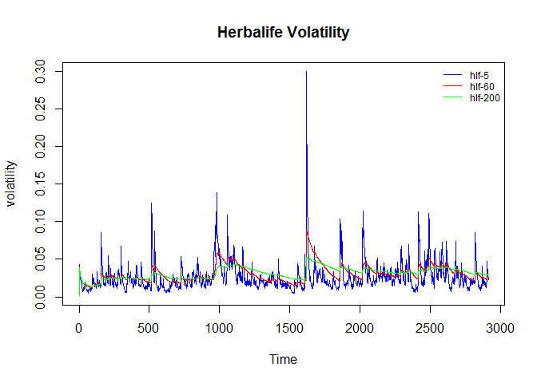
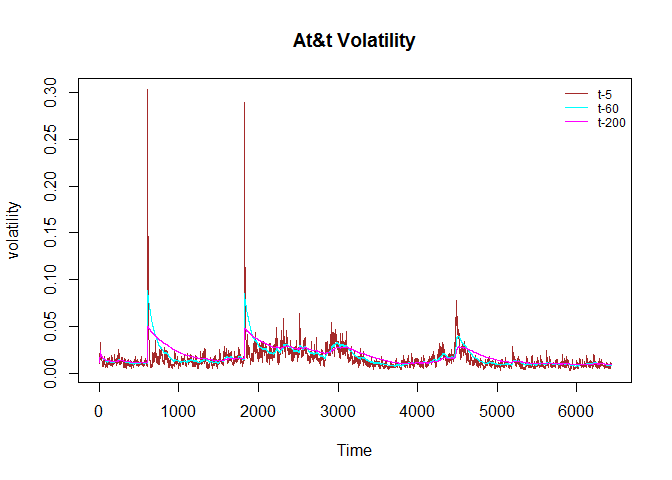

# Volatility Analysis
Kyle Killion  
July 10, 2016  

###load "tseries" to easily get and analyze volatility Data

```r
library(tseries)
```

```
## Warning: package 'tseries' was built under R version 3.3.1
```


###Downloading Daily on close data as hlfData and tData
*Tickers = Herbalife and At&t*


```r
hlfData <- get.hist.quote('hlf', quote="Close")
```

```
## time series starts 2004-12-16
```

```r
tData <- get.hist.quote('t', quote='Close')
```

###Get the log returns of hlfData and tData

```r
hlfRet <- log(lag(hlfData)) - log(hlfData)
tRet <- log(lag(tData)) - log(tData)
```

###Then calculate the volatility of the returns in percentage
*250 comes from the amount of trading days in a year*

```r
hlfVol <- sd(hlfRet) * sqrt(250) * 100
tVol <- sd(tRet) * sqrt(250) * 100
```

###Create a function here to get a continous look back of volatility over time
*d = exponentially weighted window*


```r
Vol <- function(d, logrets){
  var = 0
  lam = 0
  varlist <- c()
  
  for (r in logrets){
    lam = lam*(1 - 1/d) + 1
    var = (1-1/lam) * var + (1/lam)*r^2
    varlist<- c(varlist, var)
  }
  return(sqrt(varlist))
}
```


###We run some different weighted windows 

```r
hlfVol <- Vol(5, hlfRet)
hlfVol2 <- Vol(60, hlfRet)
hlfVol3 <- Vol(200, hlfRet)
tVol <- Vol(5, tRet)
tVol2 <- Vol(60, tRet)
tVol3 <- Vol(200, tRet)
```

###Lets plot them to get a visual of what it looks like

```r
plot(hlfVol, main="Herbalife Volatility", xlab="Time", ylab="volatility", type='l', col='blue')
lines(hlfVol2, type='l', col='red')
lines(hlfVol3, type='l', col='green')
legend('topright', legend=c('hlf-5', 'hlf-60', 'hlf-200'), 
   lty=1, col=c('blue','red','green'), bty='n', cex=.75)
```

<!-- -->

```r
plot(tVol, main="At&t Volatility", xlab="Time", ylab="volatility", type='l', col='brown')
lines(tVol2, type='l', col='cyan')
lines(tVol3, type='l', col='magenta')

legend('topright', legend=c('t-5', 't-60', 't-200'), 
   lty=1, col=c('brown','cyan','magenta'), bty='n', cex=.75)
```

<!-- -->


